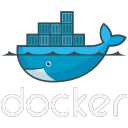

<div align="center">
     
</div>

<br/>

# Summary

- [Docker on linux](#docker-on-linux)
- [Docker container](#docker-container)
    - [Docker container create](#docker-container-create)
    - [Docker container ls](#docker-container-ls)
    - [Docker container start](#docker-container-start)
    - [Docker container stop](#docker-container-stop)
    - [Docker container attach](#docker-container-attach)
    - [Docker container rm](#docker-container-rm)
    - [Docker container run](#docker-container-run)
    - [Docker container rename](#docker-container-rename)
    - [Docker container exec](#docker-container-exec)
    - [Docker container cp](#docker-container-cp)
    - [Docker container logs](#docker-container-logs)
    - [Docker container inspect](#docker-container-inspect)
    - [Docker container commit](#docker-container-commit)
- [Docker image](#docker-image)
    - [Docker image ls](#docker-image-ls)
    - [Docker image save](#docker-image-save)
    - [Docker image rm](#docker-image-rm)
    - [Docker image load](#docker-image-load)
    - [Docker image history](#docker-image-history)
    - [Docker image build](#docker-image-build)
- [Docker volume](#docker-volume)
    - [Docker volume ls](#docker-volume-ls)
    - [Docker volume inspect](#docker-volume-inspect)
    - [Docker volume create](#docker-volume-create)
    - [Docker volume rm](#docker-volume-rm)

<br/>

## Docker on linux

<br/>

Run Docker commands in linux without sudo

```zsh
sudo chmod 666 /var/run/docker.sock
```

Exit from an attached container without stop it

```zsh
Ctrl + P + Q
```

<br/>

## Docker container

<br/>

List of commands to manipulate containers on docker

<br/>

### Docker container create

<br/>

Create a new container

```zsh
docker container create --name <containerName> -it <imageName> sh
```

<br/>

### Docker container ls

<br/>

List running containers

```zsh
docker container ls
```

List stopped/running containers

```zsh

docker container ls -a
```

<br/>

### Docker container start

<br/>

Start a container

```zsh
docker container start <containerName>
```

Start and attach a container

```zsh
docker container start -ia <containerName>
```

<br/>

### Docker container stop

<br/>

Stop a container

```zsh
docker container stop <containerName>
```

<br/>

### Docker container attach

<br/>

Run command line of an interactive container

```zsh
docker container attach <containerName>
```

<br/>

### Docker container rm

<br/>

Remove a container

```zsh
docker container rm <containerName>
```

Force to remove a container
```zsh
docker container rm -f <containerName>
```

<br/>

### Docker container run

<br/>

Create, run and attach a container

```zsh
docker container run -it --name <containerName> <imageName> sh
```

Create a container with a mapped directory
```zsh
docker container run -it -v <hostAbsolutePath>:<dockerPath> --name <containerName> <imageName> sh
```
- To add read only permission, add :ro after \<dockerPath>

Export a port from Docker container
```zsh
docker container run -d -p 80:80 --name <containerName> <imageName>
```

Run container and remove it when exit
```zsh
docker container run -it --rm --name <containerName> <imageName> sh
```

Run a container with a volume created
```zsh
docker container run -it --name <containerName> -v <volumeName>:<containerPath> <imageName> sh
```

<br/>

### Docker container rename

<br/>

Rename a container

```zsh
docker container rename <currentName> <newName>
```

<br/>

### Docker container exec

<br/>

Run a command without enter in container

```zsh
docker container exec <containerName> <command>
```

Run commands in non-interactive containers
```zsh
docker container exec -it <containerName> sh
```

<br/>

### Docker container cp

<br/>

Copy a file from a local directory to a docker container directory

```zsh
docker container cp <localDirectory> <containerName>:<containerDirectory>
```

Copy a file from a docker container directory to a local directory

```zsh
docker container cp <containerName>:<containerDirectory> <localDirectory> 
```

<br/>

### Docker container logs

<br/>

Show the last commands executed in the container terminal

```zsh
docker container logs <containerName>
```

<br/>

### Docker container inspect

<br/>

Get information about the container

```zsh
docker container inspect <containerName>
```

<br/>

### Docker container commit

<br/>

Create an docker image from a container
```zsh
docker container commit <containerName> <imageName>
```

<br/>

## Docker image

<br/>

List of commands to manipulate images on docker.

<br/>

### Docker image ls

<br/>

List all images
```zsh
docker image ls
```

<br/>

### Docker image save

<br/>

Generate a `.tar` file from a docker image
```zsh
docker image save -o <fileName>.tar <imageName>
```

<br/>

### Docker image rm

<br/>

Remove image
```zsh
docker image rm <imageName>
```

<br/>

### Docker image load

<br/>

Load an image from `.tar` file
```zsh
docker image load -i <fileName>.tar
```

<br/>

### Docker image history

<br/>

Show the history of an image
```zsh
docker image history <imageName>
```

<br/>

### Docker image build

<br/>

Create an image from a Dockerfile
```zsh
docker image build -t <imageName> <dockerfilePath>
```

<br/>

## Docker volume
<br/>

List of commands to manipulate volumes on docker.

<br/>

### Docker volume ls

<br/>

List volumes
```zsh
docker volume ls
```

<br/>

### Docker volume inspect

<br/>

Show information about the volume
```zsh
docker volume inspect <volumeName>
```

<br/>

### Docker volume create

<br/>

Create a new volume
```zsh
docker volume create <volumeName>
```

<br/>

### Docker volume rm

<br/>

Remove a volume
```zsh
docker volume rm <volumeName>
```